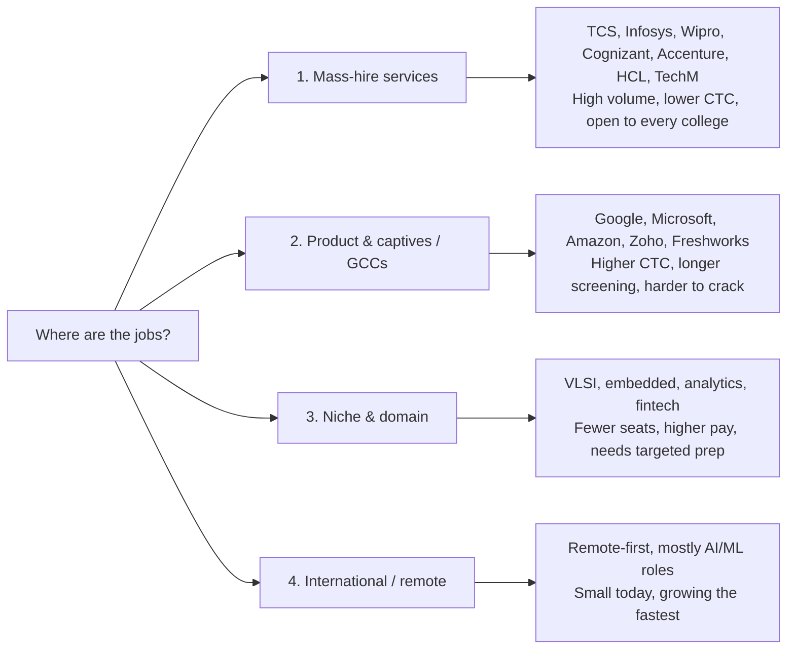
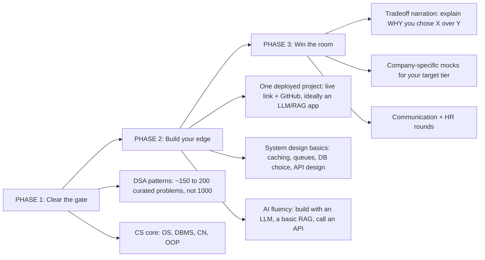

# The Last Generation to Copy-Paste Code
### And, what it means for you
**HackGrid'26 talk — working spec**

> Working document. Act 0 is detailed to final copy. Acts 1 to 6 are the agreed skeleton and will be filled in iteratively. Format: on-screen copy first, build/design notes second. This doc becomes the source for the Claude Code prompt once locked.

---

## ACT 0 — Open: "A Story of Two Boys" (Slides 1 to 14)

**Act notes:**
- The whole act is one long reveal. Both "boys" are you. The audience should not realize that until Slide 12 to 13. Protect the twist: use before/after photos (younger/unflattering vs now), or hold back a clear face on the early slides, so the reveal actually lands.
- Rhythm is rapid-fire. One line per slide, quick pacing. This is a hype build, not a reading exercise.
- Slide 14 opens the floor. Pair it with a live question board (QR code) that stays up the whole session, so "ask anytime" is literally enabled.

### Slide 1 — Title
On screen:
- Title: The Last Generation to Copy-Paste Code
- Subtitle: And, what it means for you
- Bottom: HackGrid'26

### Slide 2 — Setup
On screen: "Before I tell you who I am, and why you should be listening to me, let me tell you a 'motivational' story of two boys."

Notes: the quotes around 'motivational' are deliberate, keep the self-aware wink.

### Slide 3 — Boy 1
On screen: "This guy got 69/100 in English in his board exams. (And failed Chemistry in pre-boards.)"

Visual: photo, right side.

### Slide 4 — Boy 2
On screen: "The other boy? Got Rank #1 in Computer Science in his university."

### Slide 5 — Boy 1
On screen: "The first boy never thought he could write."

### Slide 6 — Boy 2
On screen: "This other guy became a 2X Top Writer on Medium, and authored a book on powerlifting."

### Slide 7 — Boy 1
On screen: "The first guy: lazy, unmotivated, and fat."

### Slide 8 — Boy 1 transforms
On screen: "Then one day he decided to change his life. Worked hard for it. Now he has six-pack abs."

### Slide 9 — Boy 1
On screen: "The first guy was SUPER shy about speaking in public."

### Slide 10 — Boy 2
On screen: "The second guy now has 85k+ followers on LinkedIn."

### Slide 11 — Boy 2
On screen: "Loves public speaking. Has given 150+ talks in colleges across India."

### Slide 12 — The reveal
On screen: "And is now standing in front of you."

Notes: this is the moment the two boys collapse into one person. Let it breathe.

### Slide 13 — The point
On screen: "The only difference between the first boy and the second boy? Mindset. Think. Decide. Achieve."

### Slide 14 — Open the floor
On screen:
- "I'm not telling you this to brag about the last 5 to 6 years. I'm telling you because if a lazy, unmotivated guy like me could change, so can you."
- "And I hope you now find me qualified to give this talk, and to have a real interaction with you."
- "But here's the thing: I am NOT your teacher, and I don't want to be. What I want is a completely open discussion. Any of you can stand up, share your views, disagree with me, and ask questions, at ANY point during this session."

Notes: three beats on one slide. If it feels heavy live, this can split into two slides (motivation beat, then the open-discussion invite). Cue the live question-board QR here.

---

## Table of contents (agenda slide)

Place this right after Act 0, before Act 1. A quick roadmap beat so the room knows the journey.

On screen: heading "What we'll cover today", then the list:
- 0 · A story of two boys
- 1 · My journey: VIT till now
- 2 · The AI buzzword decoder
- 3 · The placement scene in the AI era
- 4 · The 16 timeless rules
- 5 · The IT industry in the AI world
- 6 · How to grow in the AI era
- 7 · Close + AMA

Note: keep it fast, about five seconds. Nice build touch: highlight the current act here, and optionally re-show a slim version of this list at each act divider so the room always knows where they are. If you'd rather not list the story you just told, start the visible list at 1 and treat Act 0 as the cold open.

## ACT 1 — My journey: VIT till now (quick, ~3 to 4 min)

Act 0's story already carries "who am I" and "why listen to me," so this act stays quick and leans into the professional and engineering arc. Three fast slides.

### Slide 1 — The arc: VIT to now
On screen: a horizontal timeline, four nodes: VIT → first dev job → React, C#, Azure (learned on the job) → today: senior engineer, now building in AI. (Swap in your own dates and companies.)
Note: keep it fast, this is context, not a brag. The one line to land: the degree got me the interview, shipping got me the career. Do not linger on the resume.

### Slide 2 — What I actually do all day
On screen: "What my parents think I do" vs "What I actually do." (Expectation-vs-reality split.)
Note: quick and funny. The reality is less heroic typing and more figuring out what to build and why, talking to people, and shipping. The job is judgment, not just code. One beat, then move on.
Meme: the classic "what my parents think I do vs what I actually do" grid.

### Slide 3 — The one habit that compounded
On screen: "The one habit that changed everything: I learned in public."
Note: this is the seed you pay off in Act 6. Frame it personally, posting what I built and sharing what I learned is what compounded into a network, a brand, and opportunities. Plant it here, harvest it in Act 6.

## ACT 2 — The AI Buzzword Decoder (~20 min)

Goal: by the end, the room knows every hyped AI term in the market. Rapid-fire, one concept per slide, simplest first. Format per slide: concept name, [reference], one-line script. Cut/merge freely to fit 20 min (guidance at the end of the act).

### Tier 1 — What even is this
1. Artificial Intelligence (AI). [Every product today slapping an "AI-powered" sticker on it, like every dhaba being "world famous".] The umbrella word. Any machine doing something that looks smart. Half the "AI" in ads is just marketing.
2. Machine Learning (ML). [Taare Zameen Par: Ishaan learns from patterns and examples, not from a rulebook.] You don't code every rule. You show it thousands of examples and it learns the pattern itself.
3. Deep Learning / Neural Networks. [A fake brain with many layers, like a huge office where every desk passes a note up the chain.] ML inspired by brain neurons, stacked in layers. This is the engine under almost everything modern.
4. The family tree (visual slide, sums up 1 to 3). [Nested steel tiffin dabbas, each inside a bigger one.] AI is the biggest dabba, ML sits inside it, Deep Learning inside that, GenAI is the smallest and hottest one.
5. Narrow AI vs AGI vs ASI. [Chitti from Robot. A calculator or an Alexa alarm = Narrow. Chitti with the red chip = AGI, can do anything a human can. Robot 2.0 gone rogue / Skynet = ASI, smarter than all of us combined.] The ladder everyone argues about. We are firmly on step one today.

### Tier 2 — The stuff you already use
6. Generative AI (GenAI). [The one friend who can sketch, write a shayari, and edit a video, all on demand.] Old AI recognized things. GenAI creates new things: text, images, music, video.
7. Large Language Model (LLM). [The Chatur type who has read the entire internet, answer ready for everything.] The engine behind ChatGPT, Claude, Gemini. Trained to predict the next word, extremely well.
8. Tokens. [Old SMS packs where you paid per character, so you wrote "gud n8".] AI doesn't read words, it reads chunks called tokens, and you pay per token. That is literally how it counts and bills.
9. Parameters (7B, 70B, 405B). [A mixing board with billions of sliders, tuned during training.] The "brain size" number companies flex. More sliders, roughly more capable. But bigger is not always better (see scaling laws).
10. Training vs Inference. [3 Idiots: the years of mugging up = training, the viva where you answer = inference.] Training is the expensive one-time schooling. Inference is every time it answers you after that.
11. Prompt / Prompt Engineering. [The genie: you get the wish exactly as you said it, not as you meant it.] How you ask decides what you get. Vague question, cursed answer. This is a real skill now.
12. Context Window. [Ghajini: short-term memory that wipes, so he tattoos his notes on his body.] How much the AI can hold in its head at once. Talk too long and it forgets how the chat started.
13. Hallucination. [Chatur delivering the tampered speech with full confidence, never once doubting himself.] When the AI confidently makes things up. It would rather bluff than admit it doesn't know.
14. Multimodal. [One all-rounder who can see, hear, read, and speak at the same time.] Modern AI isn't just text. It takes images, audio, and video, all together.

### Tier 3 — How they are made smarter
15. Pre-training. [The gurukul phase: years of reading everything before you specialize.] The giant foundational learning on huge chunks of the internet.
16. Fine-tuning. [Chak De India: a random set of players trained into one specialized team. Or MBBS, then MD.] Take a general model and train it further for one specific job.
17. RLHF (human feedback). [Training a dog with treats. Or parents drilling sanskaar until you behave.] Humans thumbs-up and thumbs-down the answers until the AI learns to be helpful and polite.
18. RAG (Retrieval-Augmented Generation). [Open-book exam: it checks the textbook, your company's own docs, before answering instead of trusting memory.] How companies make AI answer correctly on their private data.
19. Embeddings + Vector Database. [A dating app matching by vibe, or "similar songs" on Spotify. Meaning turned into numbers so similar things sit close together.] The trick that powers search-by-meaning, and RAG under the hood.
20. Grounding / Citations. [Receipts. A journalist citing sources vs your uncle's WhatsApp forward.] Forcing the AI to back its answers with real sources so it stops bluffing.

### Tier 4 — The frontier everyone is hyping now
21. Foundation / Frontier Models. [The flagship phones everyone compares: GPT, Claude, Gemini, Llama.] The big base engines that everything else is built on top of.
22. AI Agents / Agentic AI. [Jarvis actually booking the flight and running the code, not just chatting. Or the Professor running the whole heist.] The 2026 buzzword. AI that takes actions in the real world, not just spits out text.
23. Tool Use / Function Calling. [Doraemon reaching into the pocket and pulling out the exact gadget for the problem.] Giving the AI hands: the ability to use apps, run code, search the web.
24. MCP (Model Context Protocol). [USB-C: one universal port so any AI can plug into any tool.] The standard that makes agents actually useful. Finally, one charger for everything.
25. Multi-agent systems. [A heist crew or a cricket team: each a specialist, one captain coordinating.] Instead of one AI, a team of them, each doing what it is best at.
26. Reasoning / "Thinking" models. [CID's ACP Pradyuman, "kuch to gadbad hai", working it out step by step. Or "show your working" for full marks.] Newer models that think in steps before answering, so they crack much harder problems.
27. Vibe Coding. [Telling the tailor "make me something like SRK wore" and he stitches it. You describe, it builds.] You describe an app in plain English and the AI writes the code. This is exactly what this whole talk's title is about.

### Tier 5 — The industry and safety words
28. Open vs Closed models. [Mom sharing the full recipe (open: Llama, DeepSeek) vs KFC's secret masala (closed: GPT, Claude).] Whether the recipe is public or locked. A big ongoing fight.
29. Distillation. [The whole class photocopying the topper's notes: you get the gyaan without doing all the work.] A small cheap model trained to copy a big expensive one. This is how DeepSeek shook the market.
30. Compute / GPUs (the chip war). [Petrol for the AI car. Whoever hoards the most GPUs wins, and NVIDIA sells the petrol.] AI's real bottleneck isn't ideas, it's chips. That is why NVIDIA became one of the most valuable companies on earth.
31. Scaling Laws. [Gym gains: more weight and more food means more muscle, up to a point, then diminishing returns.] The bet that bigger model + more data + more compute keeps getting smarter. Whether it is plateauing is the billion-dollar debate.
32. AI Alignment / Safety. [Ra.One (misaligned, evil) vs G.One (aligned, good). The genie taking your wish too literally.] Making a super-capable AI actually want what we want, not just do what we literally said.
33. Prompt Injection / Jailbreaking. [Sweet-talking the strict watchman with a sob story to sneak inside.] Tricking an AI into breaking its own rules with clever words. The new hacking.
34. Deepfakes. [The body-double / hamshakal trope: a fake Don who looks exactly like Don.] AI-made fake photos, voices, and videos so real you cannot tell. Handle with care.

### Optional closers (only if time allows)
35. Turing Test. [Your own "Human or AI?" game, coming up next.] The old question: can you tell you are talking to a machine? Increasingly, no.
36. The AI bubble / hype cycle. [Crypto and NFT flashbacks.] Honest question to end on: how much of this is real and how much is hype? Fair answer: both.

### Activity — "Human or AI?"
Show 2 to 3 items (a shayari, a code snippet, an AI image). Crowd votes on each. Bridges straight out of the Turing Test.

### Fitting 20 minutes
- 34 core concepts in 20 min is about 35 seconds each. Doable rapid-fire, but tight once laughs land.
- To buy breathing room: merge Tier 1 items 1 to 4 into two slides, and drop the optional closers (35, 36).
- Lowest-priority to cut if still over: 8 (Tokens), 9 (Parameters), 15 (Pre-training), 20 (Grounding), 31 (Scaling Laws). Everything else is worth keeping for a "know every hyped term" goal.
- Comfortable target: around 26 to 30 concepts for a relaxed 20 minutes with audience reactions.

## ACT 3 — The Placement Scene in the AI Era (10 to 15 min)

The most relevant act for this room. Emotional arc: name the fear honestly, then cut through BOTH the fear and the hype, show the real map, define the new bar, and hand off to "how to clear it" (Act 6). Numbers are optional ammunition, use them as sentiment ("it genuinely got harder"), not as a stats lecture. Sources tagged in brackets so you can verify or drop them.

### Slide 0 — The question everyone's scared to ask
On screen:
- Heading, big and bold: Will AI replace me?
- Sub-heading, small: Honestly, I don't know.

Talking points: this is your emotional cold-open, set the mood before any content. Open on silence and let the question hang. Do not rush to reassure. "Honestly, I don't know" is the whole move, that honesty is what earns their trust for the next 15 minutes. Hold the pause, then pivot into Slide 1: "But here is what I do know about where this is going."

### Slide 1 — The 2 AM question
On screen: "Will I even get placed?"

Talking points: say the quiet part out loud. This fear is not stupid, the ground genuinely moved under you. Validate it before you fix it.

Meme: "this is fine" dog in the burning room = CS students during placement season.

### Slide 2 — The scary headline (and it's half true)
On screen: "Fresher hiring just hit a two-decade low."

Talking points: don't sugarcoat. Entry-level tech openings fell roughly 44% in a year. One big firm (Wipro) reportedly onboarded almost no freshers in a whole quarter. The bad news is real, not imaginary. Let it land for a second. [Xpheno; 2026 reports]

Meme: wallet meme / "hiring freeze" gravestone.

### Slide 3 — But the doom is also a lie
On screen: "Not frozen. Just pickier."
On screen (small, bottom): TCS added 9,000+ people in a single quarter, its strongest hiring in nearly four years. Cognizant is expanding fresher intake about 20%, to around 25,000.

Talking points: the doom-scrollers oversell it. TCS added 9,000+ people in a single quarter, its strongest hiring in nearly four years. Cognizant is expanding fresher intake about 20% to around 25,000. TCS and Infosys are back on campuses in big numbers. So anyone saying "there are zero jobs" is wrong. [TCS Q1 FY27; Cognizant 2026]

### Slide 4 — The real story (both sides are wrong)
On screen: "Fear says AI killed all jobs. Hype says become an AI engineer by next semester. Both are wrong."
On screen (small): Context is the whole game now, raw IQ was never the bottleneck.

Talking points: this is the spine of the whole act. The truth is narrower and way more manageable than either panic. Sit here, this reframe is the thing they should remember.

### Slide 5 — What changed #1: the floor went up
On screen: "AI didn't delete the job. It raised the floor of what the job assumes."
On screen (small): Recruiters now assume basic AI fluency the way they once assumed you knew Git.

Talking points: a fresher joining in 2026 is handed an AI assistant on day one and expected to be faster because of it. So recruiters now assume basic AI fluency the way they once assumed you knew Git. At TCS, around 60% of fresher hires were AI-skilled last year, up from barely 10 to 15% three years ago. The bar moved up, it did not vanish. [FACE Prep; TCS CHRO, 2026]

### Slide 6 — What changed #2: skilled beats mass
On screen: "The 'degree = guaranteed IT job' pipeline is over."

Talking points: the era of tens of thousands of guaranteed, identical mass offers is fading. Companies want skilled or specialist freshers now, and they pay more for them. Skilled tracks are offering roughly 6 to 9 LPA, and premium tracks like TCS Prime go up to about 11 LPA, while the plain mass track stays at the bottom. Same company, very different outcomes, based on skill, not college. [FACE Prep, 2026]

### Slide 7 — The real map: where jobs actually are
On screen: four buckets, not one.

Talking points: stop tunnel-visioning on TCS. The market splits into: (1) mass-hire services (TCS, Infosys, Wipro, Cognizant, Accenture, Capgemini, HCL, Tech Mahindra), (2) product and captive companies (Google, Microsoft, Amazon, Zoho, Freshworks, GCCs), (3) niche and domain firms (VLSI, embedded, analytics, fintech), (4) international and remote-first, small but growing fastest for AI/ML. And zoom out: freshers are now being hired hard by e-commerce, startups, retail, and manufacturing too, not just IT services. More doors than your placement cell shows you.

Meme: distracted boyfriend (you staring at TCS while startups and product firms wave).

### Slide 7.1 — The four paths (flow diagram)
On screen: the four hiring paths as one branching flow, a root node splitting into four lanes. Build it as a clean left-to-right diagram in the HTML; the Mermaid below is the blueprint.

Talking points: same four buckets from Slide 7, now as one picture so it sticks. For a tier-2/3 student, paths 1 and 2 are the realistic focus, but keep an eye on path 4, that is where the AI-era money is quietly moving.

### Slide 8 — What interviews test now
On screen: "DSA still opens the door. It's just not the whole house anymore."

Talking points: three shifts. DSA is a shrinking but still-real gate, you need enough to clear the filter, but grinding 1000 problems is no longer the moat it was. System design is rising fast and is far more future-proof. And new AI-flavored rounds are showing up: "build something with an LLM", basic RAG, prompt sense. The single biggest differentiator: being able to explain WHY you chose this over that, with specifics. Memorized answers lose to a candidate who can narrate tradeoffs.

### Slide 8.1 — The actual interview prep roadmap
On screen: a three-phase roadmap shown as a left-to-right path. Blueprint below.

Talking points: walk it left to right. Phase 1 is just the filter, do enough DSA to clear it and then stop grinding. Phase 2 is where you actually separate from the crowd, and the deployed project beats everything else on this slide. Phase 3 is polish, and the tradeoff-narration box is the single highest-return thing on the whole roadmap. Tell them to pick a target company tier first, then calibrate how deep each box goes. This is the concrete "how" behind Slide 8.

### Slide 9 — The new resume math
On screen: "One shipped project beats half a CGPA point."

Talking points: a working project that is live on the internet, with a GitHub link, now carries more weight at interview than your branch or a 0.4 CGPA difference. Premium tracks literally review a deployed project before they make the offer. Marks got you the test. Shipping gets you the job.

### Slide 10 — The one-line takeaway (and the handoff)
On screen: "AI didn't remove the entry-level job. It raised the floor. Your whole game is clearing that new floor."

Talking points: land it, pause, then hand off: "So how do you actually clear it? That's the rest of this talk." Sets up the how-to-grow payoff in Act 6.

### Slide 11 — Gut-check (closes the act)
On screen: "Quick show of hands."
Ask: "How many of you have ONE project that is live on the internet right now, that I could open on my phone?" Whatever the number, it makes the "ship something" point land harder because they just felt it. Then use it as the bridge into the how-to-grow payoff (Act 6): "That number is exactly what the rest of this talk is about."

### Fitting 10 to 15 minutes
- Act 3 is now 14 slide-units (Slides 0 through 11, plus 7.1 and 8.1). Several are quick: Slide 0 is seconds, the two diagram slides are visual pauses, Slide 11 is a fast show of hands. Realistically it lands around 14 to 16 min with reactions, the top of your window.
- To pull it back: merge Slides 2 and 3 into one "bad news, but not doom" slide, and let the Slide 7.1 diagram replace the spoken four-bucket list on Slide 7 instead of adding to it.
- Do not cut Slides 4, 5, 8.1, and 10. The reframe, the floor-rose point, the prep roadmap, and the takeaway are the spine.

## ACT 4 — The 16 Timeless Rules: Use Them to Become So Good They Can't Ignore You
Subtitle: Or, ignore them to stay average

Your existing "16 Rules" deck, extracted slide by slide, in order. It opens by calling back to the two-boys story from Act 0 ("why was I telling you my story?"), then delivers the 16 rules, each set up with a pop-culture hook, a scripture anchor, or a personal example, then paid off with the rule itself. Below, S# is the slide, the main line is the on-screen headline, and "sub" is the smaller supporting line.

Note: I fixed a few obvious typos and OCR artifacts from the export and re-rendered the Sanskrit and Hindi verses correctly. Three copyrighted third-party passages (the APJ Abdul Kalam "Wings of Fire" quote, the Ramdhari Singh Dinkar "Kurukshetra" poem, and the Jordan Peterson quote) are referenced by attribution only and not re-typed, since I can't reproduce copyrighted poems or long quotes. Your slides already hold the full text, so keep those as they are.

S1 · THE 16 RULES THAT ARE UNBREAKABLE (section title card, label "Section 1")
S2 · WHY WAS I TELLING YOU MY STORY? (sub: "What's the one learning that you can take from my personal experiences that I shared with you just now?")
S3 · 1. YOU CAN ACHIEVE ANYTHING YOU TRULY BELIEVE IN!
S4 · HAVE YOU WATCHED MONEY HEIST? (sub: "Remember how things almost became unimaginably complex and chaotic towards the end?")
S5 · OR, DID YOU NOTICE WHAT BRUCE WAYNE WENT THROUGH? (sub: "Did you notice how totally messed up his life became before he was able to defeat joker?")
S6 · 2. IF EVERYTHING IS GOING AGAINST YOUR PLAN, YOU ARE VERY CLOSE TO YOUR GOAL.
S7 · DO YOU WANT TO KNOW WHY? (sub: "I tried my BEST to get abs when I was in college, but somehow I just COULDN'T no matter how hard I tried...")
S8 · 3. THINGS DON'T COME TO YOU WHEN YOU WANT THEM, THEY COME TO YOU WHEN YOU ARE READY FOR THEM!
S9 · WHAT'S THE BIGGEST LEARNING FROM BHAGAVAD GITA? (sub: "Tell me...")
S10 · Bhagavad Gita 2.47: कर्मण्येवाधिकारस्ते मा फलेषु कदाचन। मा कर्मफलहेतुर्भूर्मा ते सङ्गोऽस्त्वकर्मणि॥ (English: "You have the right to work only but never to its fruits. Let not the fruits of action be your motive, nor let your attachment be to inaction.")
S11 · 4. THE BAD PART IS, THAT YOU HAVE ABSOLUTELY NO CONTROL OVER THE RESULTS...
S12 · CAN YOU IMAGINE HIM AS AN AIR FORCE PILOT? (sub: "Sounds, unreasonable, right?"; image: APJ Abdul Kalam)
S13 · Quote: APJ Abdul Kalam, Wings of Fire (the "Desire, when it stems from the heart and spirit..." passage; keep full text from your slide, not re-typed here for copyright)
S14 · THE TIME WHEN I COULDN'T GO TO US... (sub: "Of course, not as inspiring, but even I have many such stories, and I bet you too have these!")
S15 · 5. THE GOOD PART IS, THAT WHEN YOU DON'T GET WHAT YOU WANT, IT'S BECAUSE GOD HAS BIGGER PLANS FOR YOU!
S16 · FEAR - ONLY GOD / LOVE - EVERYONE / BELIEVE - IN THE POWER OF UNIVERSE / WORK HARD - DAILY
S17 · PROFESSOR WITHOUT HEIST? (sub: "Can you imagine...")
S18 · BHAGAT SINGH WITHOUT BRITISH EMPIRE? (sub: "Can you imagine...")
S19 · MS DHONI WITHOUT HIS PASSION FOR CRICKET? (sub: "Can you imagine...")
S20 · RAM WITHOUT RAVAN? (sub: "Can you imagine...")
S21 · KRISHNA WITHOUT KANSA? (sub: "Can you imagine...")
S22 · 6. NO HERO EXISTS WITHOUT A VILLAIN. THAT'S THE LAW OF DUALITY!
S23 · TELL ME! (sub: "Did Alexander the great not kill people?")
S24 · TELL ME! (sub: "OR, did people not die during Mahabharata?")
S25 · STILL, YOU FEEL IT'S NOT BAD, ISN'T IT? (sub: "And, there are million more examples,")
S26 · Bhagavad Gita 2.38: सुखदुःखे समे कृत्वा लाभालाभौ जयाजयौ। ततो युद्धाय युज्यस्व नैवं पापमवाप्स्यसि॥ (English: "Fight for the sake of duty, treating alike happiness and distress, loss and gain, victory and defeat. Fulfilling your responsibility in this way, you will never incur sin."; Bhagavad Gita, Chapter 2, Verse 38)
S27 · 7. PEOPLE WHO DON'T TAKE THINGS PERSONALLY, ARE ATTACHED TO A MISSION, AND DO THEIR DUTY ARE MORE LIKELY TO SUCCEED IN LIFE
S28 · HOW DO PEOPLE GET STRONG? (sub: "Do they become spiderman in a night like peter parker?")
S29 · HOW DO SOME PEOPLE MANAGE TO CLEAR MOST DIFFICULT EXAMS? (sub: "Do they study one night before?")
S30 · 8. ALL RESULTS COME FROM 'PROGRESSIVE OVERLOAD'
S31 · RAM SETU... (sub: "Do you know this incident from Ramayan?")
S32 · Ramcharitmanas (doha): विनय न मानत जलधि जड़, गए तीनि दिन बीति। बोले राम सकोप तब, भय बिनु होइ न प्रीति॥ (English: "You should have the power to declare a war, and still choose peace.")
S33 · Poem: Ramdhari Singh Dinkar, Kurukshetra (the "क्षमा, दया, तप, त्याग..." excerpt; keep full text from your slide, not re-typed here for copyright)
S34 · 9. TO WIN IN LIFE, YOU NEED 3 "C": CONFIDENCE, COMPETENCE, AND BEING COMBAT READY!
S35 · Quote: Dr. Jordan B Peterson (on a good man being a dangerous man who keeps it under voluntary control; keep full text from your slide)
S36 · QUICK QUESTION... (sub: "Imagine yourself talking to 2 separate people, First one just keeps talking, Second one asks you questions, and listens to you more. Whom do you like/trust/respect more?")
S37 · 10. ALL HUMAN BEINGS HAVE A TENDENCY TO FEEL MORE IMPORTANT/POWERFUL WHEN THEY ARE BEING LISTENED. (sub: "How to use this? Ask lots of questions while speaking.")
S38 · DID YOU KNOW? (sub: "Working out increases endorphin levels which reduces your stress and boost your self-confidence, and overall sense of wellbeing?")
S39 · 11. TRUST IN GOD, AND A GOOD WORKOUT - THAT'S ALL YOU NEED TO BOOST YOUR MOOD. (sub: "Trust in 'nature' if you're an atheist. You NEED to have some faith, if not god, then have faith in nature.")
S40 · 12. NO ONE CAN CARE ABOUT YOU AS MUCH AS YOU YOURSELF. (sub: "This doesn't mean you have to be selfish. This means, no one else is responsible for you!")
S41 · BHAAG MILKHA BHAAG (sub: "Do you remember the scene where he finally wins the nationals, but when he comes back, his girlfriend already got married? And, asked his teacher, 'what is he winning? what is he losing?'")
S42 · 13. YOU ARE GOING TO LOSE FRIENDS IN THE PROCESS. (sub: "But, you are going to get new friends as well!")
S43 · ESCAPE VELOCITY (sub: "Do you know how a space shuttle goes to space?")
S44 · ROAD WORK? (sub: "Do you know why a boxer does...")
S45 · 14. SPEED DEFIES GRAVITY! A RABBIT WILL ALWAYS BEAT A TURTLE! (sub: "The rabbit from our old story was lazy, don't listen to that story.")
S46 · CAN YOU CONTROL THE ACTIONS OF THE PERSON SITTING NEXT TO YOU? (sub: "Or, your friend? Or, your partner? Or, your relatives? Or, anyone in the world?")
S47 · 15. YOUR MIND IS THE ONLY THING YOU CAN EVER CONTROL! (sub: "But, that's the only thing you need to control. If you control your mind, you can control the world!")
S48 · THE OUTER WORLD IS A DELAYED REFLECTION OF YOUR INNER WORLD!
S49 · CAN YOU CRACK IIT BY READING NCERT? (sub: "This is the final one, I swear ;)")
S50 · 16. BEING JUST "ONE STEP AHEAD" IS A SURE-SHOT WAY TO WIN IN LIFE!

Flow and timing notes:
- This is 50 slides, but most are single-line rapid beats (a setup or "can you imagine X without Y" hook, then the rule), so it moves faster than the count suggests. Still, it is by far the longest act; budget for it, and decide whether all 16 rules survive to the final or whether you trim to the strongest 8 to 10 for time.
- The rules group loosely into three arcs you could badge on-screen: belief and destiny (1 to 5), duality and detachment (6 to 9), people and self-mastery (10 to 16).
- This whole act pays off Act 0. A one-line callback on S2 helps the audience feel the loop close.

## ACT 5 — The IT industry in the AI world (5 to 7 min)

Quick act, zoomed out from "your first job" (Act 3) to the industry itself. Five fast slides: what's breaking, where the work moved, what's dying vs booming, how the shape is changing, and the reframe. Keep it punchy, sentiment over stats.

### Slide 1 — The model that built Indian IT is cracking
On screen: "The 'bench army' era is ending."
Note: for two decades the model was simple, hire thousands of freshers, park them on the bench, train them, bill them out. AI just automated the bottom of that pyramid. Say it honestly, not fearfully.
Meme: dinosaurs looking up at the incoming meteor (the bench-army model, meet AI).

### Slide 2 — The work moved: services to captives (GCCs)
On screen: "The real action shifted from services to GCCs."
Note: GCC = Global Capability Center (also called a captive), a global company's own engineering office in India instead of outsourcing to a services firm. Think Google, Microsoft, Walmart, JPMorgan running big India centers where staff work directly for the parent, not a middleman. That is where the better-paid product work lives now. Spell the term out for the room, most students won't know it either. If your whole map is TCS and Infosys, you are staring at the shrinking half.

### Slide 3 — What's dying vs what's booming
On screen: two columns. Dying: rote ticket-work, manual testing, copy-paste coding, L1 support. Booming: building with AI, data and ML, cloud and platform, product engineering.
Note: the work that gets automated first is the work that never asked you to think. The work that grows is the work that builds something.
Meme: Drake meme (no to rote testing, yes to shipping with AI).

### Slide 4 — The pyramid is becoming a diamond
On screen: "Fewer juniors doing rote work. More skilled people building."
Note: the old staffing pyramid with its huge fresher base is flattening. Smaller teams ship bigger things now. Scary if you wanted the guaranteed bench seat, pure leverage if you are the skilled one.

### Slide 5 — The good news (reframe)
On screen: "The industry isn't shrinking. It's rewiring."
Note: Indian IT is still growing and still hiring, just differently. Fewer rote seats, more builder seats. The question is not "will there be jobs", it is "which side of the rewiring are you on". Leverage, not doom. Hands straight into Act 6.

## ACT 6 — How to grow in the AI era (main focus, ~10 to 12 min)

The payoff. Everything before this was the map; this is the move. Keep the energy high, this is the emotional climax before the AMA. Same per-slide format as Act 3.

### Slide 1 — From "what's happening" to "what you do"
On screen: "Enough about the world. Let's talk about you."
Note: this is the pivot the whole talk was built toward. Say it with a lift in energy. The mood should change from "here is the scary map" to "here is exactly what you do about it."

### Slide 2 — Become the person who ships
On screen: "One shipped project beats a 9 CGPA."
Note: the single highest-leverage move a student can make. Not another course, not another certificate, one real thing that is live on the internet with a link you can open right now. Build small, but finish it and deploy it. Marks got you the interview; shipping gets you the job.
Meme: "Talk is cheap. Show me the code." (Linus Torvalds.)

### Slide 3 — Learn in public
On screen: "Build. Post. Repeat."
Note: a fresher with no network can build one from scratch by working in the open. Post what you build on LinkedIn and X, write up how you did it. Every post is proof of work and a magnet for recruiters and opportunities. Most students never do this because it feels cringe. That is exactly why it works, do it anyway.
Meme: "nobody: / me posting my tiny project on LinkedIn" (own the cringe).

### Slide 4 — The AI-adjacent skills that actually pay
On screen: "You don't need a PhD. You need to build ONE thing with AI."
Note: four skills matter right now, prompting well, a basic RAG, a simple agent, and evaluating AI output. You do not need to master all four. Pick one, build one small project (a chatbot over your own notes, a resume screener, a study-buddy), and you are already ahead of most of your batch. The barrier is lower than it has ever been, so the excuse is gone.

### Slide 5 — Activity: Prompt Battle (live)
On screen: "Let's settle prompting, live."
Note: take a lazy one-line prompt from the audience, run it on Claude or ChatGPT on the projector, then rewrite it specific and detailed and run it again. Show the gap on screen. Three minutes, and it teaches the single most useful AI skill better than any slide could. This is your energy peak of the act, milk it.

### Slide 6 — Stay a T-shaped engineer
On screen: "AI is the branch. Fundamentals are the trunk."
Note: do not skip DSA and system design to chase AI. AI on top of zero fundamentals is a house on sand, and the first hard interview question exposes it. Keep the trunk strong (enough DSA to clear gates, system design for real depth), then grow the AI branch on top. Deep in one thing, working knowledge across many.
Meme: buff Doge (fundamentals) vs Cheems (AI hype with no basics). Or house on rock vs house on sand.

### Slide 7 — The one line to carry home
On screen: "AI won't take your job. An engineer who uses AI will. Go be that engineer."
Note: if they forget everything else today, this is the sentence that should survive. Say it, pause, let it land. This is the emotional takeaway of the entire talk.

### Slide 8 — Your move this weekend
On screen: "Ship one tiny thing by Monday."
Note: convert the inspiration into action before it fades. One concrete challenge, pick a small idea, build it with AI help, deploy it, post the link. That is the whole playbook compressed into a single weekend. Then open the floor: "That's what I wanted to share. Now let's talk." Hands into Act 7 (close + AMA).

## ACT 7 — Close + AMA (skeleton)

- One slide, one takeaway, plus where to find you (TheLeanProgrammer handles + QR). This is the outreach payoff.
- AMA. QR to the live question board that has been open since Slide 14.

---

## Interactive spine (to bake into the Claude Code build)

- Running gag: "AI Buzzword Bingo" card (AGI, LLM, "disrupt," "10x," "prompt engineer") that fills as terms come up.
- Activities: show-of-hands opener, Human-or-AI vote, Prompt Battle, always-on QR question board.
- HTML interactivity: click-to-reveal punchlines, keyboard nav, embedded meme GIFs, animated act-dividers.
